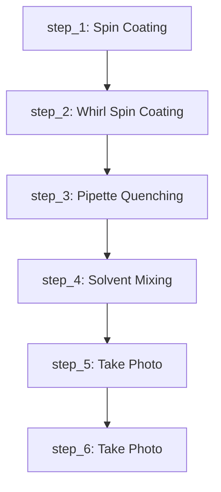

yyrliu: Please visualize and summarize all the Processes

Workspace: Collecting workspace informationHere is a summary and visualization of all the `Process` steps defined in try-all.yaml:

---

## Summary Table

| Step    | Process Name             | Description/Notes                |
|---------|-------------------------|----------------------------------|
| step_1  | Spin Coating            | Spin coating process for up to 8 substrates, with detailed parameters for each. |
| step_2  | Whirl Spin Coating      | Whirl spin coating, adds "Arm Speed While Dispending" and "Dispense range" fields. |
| step_3  | Pipette Quenching       | Pipette quenching, includes quench-specific parameters and a "Decap and Recap Vial" option. |
| step_4  | Solvent Mixing          | Solvent mixing, with aspirate/dispense parameters and matrix loading. |
| step_5  | Take Photo              | Take photo of each substrate.    |
| step_6  | Take Photo              | Take photo of each substrate.    |

---

## Visualization



---

### Details

- **Spin Coating**: Standard spin coating with parameters for annealing, pipetting, spinning, etc.
- **Whirl Spin Coating**: Similar to spin coating but with additional parameters for arm speed and dispense range.
- **Pipette Quenching**: Adds quenching steps, including quench pipette and solution parameters.
- **Solvent Mixing**: Focuses on aspirate/dispense operations and matrix loading.
- **Take Photo**: Simple step to take photos of each substrate (repeated twice).

You can find these definitions in try-all.yaml under each `step_X` key.

yyrliu: Please draw a timeline of when and what happens depending on what parameter, for example, 

Whirl Spin Coating:

start -> spin at `Initial Spin Velocity`-> Dispense
             ------------------------------------
             `Dispense-Spin/Blade Delay` second


GitHub Copilot: Here is a timeline for each main process, showing the sequence of actions and where key parameters are used:

---

### **Spin Coating (step_1)**

```
start
  |
  |---> (optional) Annealing: 
  |         [Annealing Station Number, Annealing Temperature, Annealing Time]
  |
  |---> Pipette Preparation:
  |         [Pipette Rack Number, Tip Type, Solution Number, Solution Volume]
  |
  |---> (optional) Mixing:
  |         [Mixing Cycles Aspiration, Liquid Class Index Aspiration/Dispensing]
  |
  |---> Dispense onto substrate:
  |         [Pipette Dispensing Height Above Substrate]
  |
  |---> Wait:
  |         [Dispense-Spin/Blade Delay (s)]
  |
  |---> Spin:
  |         [Spin Acceleration, Spin Time, Spin Velocity, Spincoater Number]
  |
  |---> (optional) Put on Hotplate
  |         [Put on Hotplate]
  |
  |---> Discard Pipettes
```

---

### **Whirl Spin Coating (step_2)**

```
start
  |
  |---> (optional) Annealing
  |
  |---> Set Spincoater to Initial Spin Velocity
  |         [Initial Spin Velocity (Before Dispensing)]
  |
  |---> Move Arm at Speed
  |         [Arm Speed While Dispending]
  |
  |---> Dispense along Range
  |         [Dispense range (mm), Pipette Dispensing Height]
  |
  |---> Wait:
  |         [Dispense-Spin/Blade Delay (s)]
  |
  |---> Spin:
  |         [Spin Acceleration, Spin Time, Spin Velocity]
  |
  |---> (optional) Put on Hotplate
  |
  |---> Discard Pipettes
```

---

### **Pipette Quenching (step_3)**

```
start
  |
  |---> (optional) Annealing
  |
  |---> Pipette Preparation (as above)
  |
  |---> Dispense onto substrate
  |
  |---> Wait:
  |         [Dispense-Spin/Blade Delay (s)]
  |
  |---> Spin:
  |         [Spin Acceleration, Spin Time, Spin Velocity]
  |
  |---> Quench Step:
  |         [Quench Solution, Quench Volume, Quench Height, Quench Tip Type]
  |
  |---> Wait:
  |         [Quench-Spin Delay (s)]
  |
  |---> Second Spin:
  |         [Second Spin Acceleration, Second Spin Time, Second Spin Velocity]
  |
  |---> (optional) Put on Hotplate
  |
  |---> Discard Pipettes
  |
  |---> (optional) Decap and Recap Vial
```

---

### **Solvent Mixing (step_4)**

```
start
  |
  |---> Aspirate:
  |         [Aspirate Index, Solution Number, Solvent Station Number, Volume]
  |
  |---> Dispense:
  |         [Dispense Index, Solution Number, Solvent Station Number, Volume]
  |
  |---> (optional) Load Dispense Matrix
  |
  |---> Discard Pipettes
```

---

### **Take Photo (step_5 & step_6)**

```
start
  |
  |---> Take Photo
```

---

**Note:**  
- Steps in parentheses (optional) depend on whether the corresponding parameter is set.
- Each substrate in a step follows the same timeline, with its own parameter values.  
- Delays and actions are controlled by the parameters listed in brackets.

yyrliu: The parameters are not in order, usually Annealing is the last step after Put on Hotplate

GitHub Copilot: Thank you for clarifying the correct order. Here is an updated timeline for a typical process (Spin Coating, Whirl Spin Coating, Pipette Quenching), reflecting that **Annealing** is the last step after "Put on Hotplate":

---

### **Spin Coating / Whirl Spin Coating Timeline**

```
start
  |
  |---> Pipette Preparation
  |         [Pipette Rack Number, Tip Type, Solution Number, Solution Volume]
  |
  |---> (optional) Mixing
  |         [Mixing Cycles Aspiration, Liquid Class Index Aspiration/Dispensing]
  |
  |---> Dispense onto substrate
  |         [Pipette Dispensing Height Above Substrate]
  |
  |---> Wait
  |         [Dispense-Spin/Blade Delay (s)]
  |
  |---> Spin
  |         [Spin Acceleration, Spin Time, Spin Velocity, Spincoater Number]
  |
  |---> (optional) Put on Hotplate
  |         [Put on Hotplate]
  |
  |---> (optional) Annealing
  |         [Annealing Station Number, Annealing Temperature, Annealing Time]
  |
  |---> Discard Pipettes
```

---

### **Pipette Quenching Timeline**

```
start
  |
  |---> Pipette Preparation
  |
  |---> Dispense onto substrate
  |
  |---> Wait
  |         [Dispense-Spin/Blade Delay (s)]
  |
  |---> Spin
  |
  |---> Quench Step
  |         [Quench Solution, Quench Volume, Quench Height, Quench Tip Type]
  |
  |---> Wait
  |         [Quench-Spin Delay (s)]
  |
  |---> Second Spin
  |
  |---> (optional) Put on Hotplate
  |
  |---> (optional) Annealing
  |
  |---> Discard Pipettes
  |
  |---> (optional) Decap and Recap Vial
```

---

**Note:**  
- "Put on Hotplate" and "Annealing" are now at the end, with Annealing as the final step.
- Each substrate follows this sequence with its own parameters.
- Optional steps depend on whether the corresponding parameter is set.

yyrliu: for Whirl Spin Coating, spining is prior to dispense

GitHub Copilot: Correct! For **Whirl Spin Coating**, the timeline should reflect that spinning starts before dispensing. Here’s the correct sequence with parameter mapping:

---

### **Whirl Spin Coating Timeline**

```
start
  |
  |---> Pipette Preparation
  |         [Pipette Rack Number, Tip Type, Solution Number, Solution Volume]
  |
  |---> (optional) Mixing
  |         [Mixing Cycles Aspiration, Liquid Class Index Aspiration/Dispensing]
  |
  |---> Set Spincoater to Initial Spin Velocity
  |         [Initial Spin Velocity (Before Dispensing) (rpm)]
  |
  |---> Move Arm at Speed and Dispense along Range
  |         [Arm Speed While Dispending (0-100%), Dispense range (mm), Pipette Dispensing Height Above Substrate]
  |
  |---> Wait
  |         [Dispense-Spin/Blade Delay (s)]
  |
  |---> Spin (main spin)
  |         [Spin Acceleration (rpm/s), Spin Time (s), Spin Velocity (rpm), Spincoater Number]
  |
  |---> (optional) Put on Hotplate
  |         [Put on Hotplate]
  |
  |---> (optional) Annealing
  |         [Annealing Station Number, Annealing Temperature (°C), Annealing Time (s)]
  |
  |---> Discard Pipettes
```

**Key:**  
- Spinning at `Initial Spin Velocity` happens **before** dispensing.
- Main spin parameters (`Spin Acceleration`, `Spin Time`, `Spin Velocity`) are applied after dispensing and delay.
- Hotplate and annealing are at the end.

yyrliu: please do not omit anything, for example, you skipped Pipette Preparation parameters and mixing in Pipette Quenching Timeline

GitHub Copilot: Certainly! Here are the **full, detailed timelines** for each process, with all parameters included and in the correct order, based on your YAML file.

---

## **Spin Coating (step_1)**

```
start
  |
  |---> Pipette Preparation:
  |         Pipette Rack Number
  |         Tip Type
  |         Solution Number
  |         Solution Volume (uL)
  |         Solvent Station Number
  |
  |---> (optional) Mixing:
  |         Mixing Cycles Aspiration (0-9)
  |         Liquid Class Index Aspiration
  |         Liquid Class Index Dispensing
  |
  |---> Dispense onto substrate:
  |         Pipette Dispensing Height Above Substrate (mm)
  |
  |---> Wait:
  |         Dispense-Spin/Blade Delay (s)
  |
  |---> Spin:
  |         Spin Acceleration (rpm/s)
  |         Spin Time (s)
  |         Spin Velocity (rpm)
  |         Spincoater Number
  |
  |---> (optional) Put on Hotplate:
  |         Put on Hotplate
  |
  |---> (optional) Annealing:
  |         Annealing Station Number
  |         Annealing Temperature (°C)
  |         Annealing Time (s)
  |
  |---> Discard Pipettes
```

---

## **Whirl Spin Coating (step_2)**

```
start
  |
  |---> Pipette Preparation:
  |         Pipette Rack Number
  |         Tip Type
  |         Solution Number
  |         Solution Volume (uL)
  |         Solvent Station Number
  |
  |---> (optional) Mixing:
  |         Mixing Cycles Aspiration (0-9)
  |         Liquid Class Index Aspiration
  |         Liquid Class Index Dispensing
  |
  |---> Set Spincoater to Initial Spin Velocity:
  |         Initial Spin Velocity (Before Dispensing) (rpm)
  |
  |---> Move Arm at Speed and Dispense along Range:
  |         Arm Speed While Dispending (0-100%)
  |         Dispense range (mm)
  |         Pipette Dispensing Height Above Substrate (mm)
  |
  |---> Wait:
  |         Dispense-Spin/Blade Delay (s)
  |
  |---> Spin (main spin):
  |         Spin Acceleration (rpm/s)
  |         Spin Time (s)
  |         Spin Velocity (rpm)
  |         Spincoater Number
  |
  |---> (optional) Put on Hotplate:
  |         Put on Hotplate
  |
  |---> (optional) Annealing:
  |         Annealing Station Number
  |         Annealing Temperature (°C)
  |         Annealing Time (s)
  |
  |---> Discard Pipettes
```

---

## **Pipette Quenching (step_3)**

```
start
  |
  |---> Pipette Preparation:
  |         Pipette Rack Number
  |         Tip Type
  |         Solution Number
  |         Solution Volume (uL)
  |         Solvent Station Number
  |
  |---> (optional) Mixing:
  |         Mixing Cycles Aspiration (0-9)
  |         Liquid Class Index Aspiration
  |         Liquid Class Index Dispensing
  |
  |---> Dispense onto substrate:
  |         Pipette Dispensing Height Above Substrate (mm)
  |
  |---> Wait:
  |         Dispense-Spin/Blade Delay (s)
  |
  |---> Spin:
  |         Spin Acceleration (rpm/s)
  |         Spin Time (s)
  |         Spin Velocity (rpm)
  |         Spincoater Number
  |
  |---> Quench Step:
  |         Quench Pipette Rack Number
  |         Quench Tip Type
  |         Quench Solution Number
  |         Quench Solution Volume (uL)
  |         Quench Solvent Station Number
  |         Quench Height Above Substrate (mm)
  |         Quench Liquid Class Index Aspiration
  |         Quench Liquid Class Index Dispensing
  |
  |---> Wait:
  |         Quench-Spin Delay (s)
  |
  |---> Second Spin:
  |         Second Spin Acceleration (rpm/s)
  |         Second Spin Time (s)
  |         Second Spin Velocity (rpm)
  |
  |---> (optional) Put on Hotplate:
  |         Put on Hotplate
  |
  |---> (optional) Annealing:
  |         Annealing Station Number
  |         Annealing Temperature (°C)
  |         Annealing Time (s)
  |
  |---> Discard Pipettes
  |
  |---> (optional) Decap and Recap Vial
```

---

## **Solvent Mixing (step_4)**

```
start
  |
  |---> Aspirate:
  |         Aspirate Index
  |         Aspirate Solution Number
  |         Aspirate Solvent Station Number
  |         Aspirate Volume
  |
  |---> Dispense:
  |         Dispense Index
  |         Dispense Solution Number
  |         Dispense Solvent Station Number
  |         Dispense Volume
  |
  |---> (optional) Load Dispense Matrix
  |
  |---> Pipette Preparation:
  |         Pipette Rack Number
  |         Tip Type
  |
  |---> Discard Pipettes
```

---

## **Take Photo (step_5 & step_6)**

```
start
  |
  |---> Take Photo: true
```

---

**All parameters are now included and in the correct order for each process.**